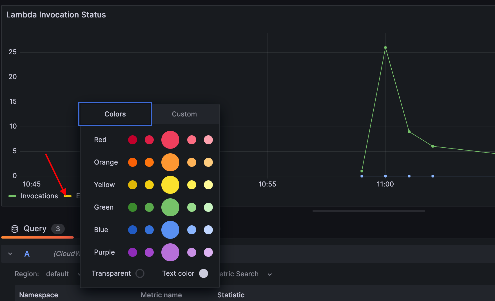

# Breakout 1: Monitoring an AWS Data Pipeline with Grafana

## Background
You are a member of the DevOps/SRE team at FictionTech, a technology company. The data team has recently set up a new data processing pipeline. This pipeline ingests raw data files from an [S3 bucket (object storage)](https://aws.amazon.com/s3/), processes/analyzes the data in using a series of [AWS Lambda functions (serverless compute)](https://aws.amazon.com/lambda/), and then stores the results of the analysis in a [DynamoDB table (NoSQL database)](https://aws.amazon.com/dynamodb/). This setup enables quick access to processed data for the company's analytics team.

Your manager has asked you to ensure the health, efficiency, and performance of this new data processing pipeline. To effectively track the pipeline's performance, you have decided to set up a Grafana dashboard.

## Lab Objective
Set up a Grafana dashboard that aids in monitoring the health and performance of the data processing pipeline. This pipeline reads data from an S3 bucket, processes it using Lambda functions, and stores the processed results in DynamoDB. In the lab you will utilize data from two pre-configured data sources in your Grafana environment: 

- [AWS CloudWatch](https://grafana.com/grafana/plugins/cloudwatch/) - a service that collects monitoring data, offering a comprehensive view of AWS resources, applications, and services. CloudWatch facilitates the setup of alarms, visualization of logs and metrics, and automated troubleshooting actions.

- [AWS X-Ray](https://grafana.com/grafana/plugins/grafana-x-ray-datasource/) - a tracing service that enables analysis and debugging of applications, highlighting user journeys across distributed components.

[Click here](./plugin_basics.md) if you want to learn more about AWS specific Grafana plugins. Remember plugins do not force you to move your data instead they allow you to query the data without moving it. 

## Lab Steps
### Part 1: Access Grafana Cloud Environment
```Step 1:``` Log into your Grafana instance by going to the Grafana website using URL, login and password credentials you were sent.


### Part 2: Creating a new Dashboard
In this lab you will create a new dashbaord and add a few panels to a dashboard that will provide a high-level overview of useful metrics that define the health and performance of the data processing pipeline.

```Step 1:``` In the upper left hand corner open up the Menu Bar by clicking on the Icon next to the word 'Home' -> 'Dashboards'


```Step 2:``` On the dashboard home page click 'New' -> 'New Dashboard'


```Step 3:``` In the dashboard on the upper right hand corner click on the 'Gear' button


```Step 4:``` Replace the field Name with "AWS Data Pipeline - <Your Name>"

```Step 5:``` Click 'Save dashboard' on the top right hand corner

****Pro Tip: Even though we are creating dashboards from scratch today, a good place to start when onboarding a new data source into grafana is our [community dashbaord search](https://grafana.com/grafana/dashboards). There are over 5000 different example dashboards available. As well when utlizing Grafana Cloud some data sources come with example dashboards out of the box. For instance for AWS Cloudwatch it has 5 dashboards available out of the box you can [optionally import](https://grafana.com/grafana/dashboards).*

### Part 3: Add a Panel to Show Lambda Invocation Status
Knowing the success rate of your Lambda functions provides a clear picture of the health of your processing component. A high failure or throttle rate may indicate issues that need immediate attention. In this graph we are going to visualize the invocation over time graphed with throttle events and errors.

```Step 1:``` Click 'Add' -> 'Visualization'

```Step 2:``` Select *Cloudwatch* as the Data source

```Step 3:``` Then Select *AWS/Lambda* for your Namespace, *Invocations* as your Metric name, and *Sum* as your Statistic

```Step 4:``` Distinguish between successful, failed, and throttled invocations using colors. To do so click on the small color box next to each label on the axis. Set Invocations to Purple, Set Errors to Red, and set Throttles to Yellow.



```Step 5:``` On the right hand side ensure that the graph is set to Time series, if not click the drop down and select it.


```Step 6:``` On the right hand side change the Title of the graph to be "Lambda Invocations".

```Step 7:``` In the search bar type in "Line Width" and change the value to 2 

*[Click here](https://play.grafana.org/d/000000016/1-time-series-graphs?orgId=1) for inspiration on the modifications you can make to the timeseries panel.*

```Step 8:``` Press `save` and then press 'apply'

### Part 4: Add a Panel to Lambda Error Rate
In this graph we will explore how you can show the error rate as a stat panel for easy viewing.

```Step 1:``` Add another panel to the dashboard

```Step 2:``` Select *CloudWatch* as the data source

```Step 3:``` Select *AWS/Lambda* for your Namespace, *Invocations* as your Metric name, and *Sum* as your Statistic

```Step 4:``` Scroll down and click `+ add query`


```Step 5:``` Select *AWS/Lambda* for your Namespace, *Errors* as your Metric name, and *Sum* as your Statistic

```Step 6:``` Scroll down and click add '+ expression'

```Step 7:``` Set the operation to *Math* and the expression to "$A/$B"


```Step 8:``` For the first two queries hit the 'eye' icon to hide the query


```Step 9:``` Click the 'Transform' tab

```Step 10:``` Click the drop down and select 'Organize fields'

```Step 11:``` Change the name of the non time field to "Error Rate"


```Step 12:``` On the right hand side set the graph type to be Stat panel

```Step 13:``` On the right hand side change the Title of the graph to be "Lambda Controller Error Rates".

*[Click here](https://play.grafana.org/d/Zb3f4veGk/2-stats?orgId=1) for inspiration on the modifications you can make to the stat panel.*

```Step 14:``` Press 'save' and then press 'apply'

### Part 5: Add a Panel to Show Error Logs
In this part we will show you one option for presenting log data on a dashboard.

```Step 1:``` Add your final panel

```Step 2:``` Choose *CloudWatch*

```Step 3:``` Change the drop down from 'Cloudwatch Metrics' to 'Cloudwatch Logs'

```Step 4:``` Select the log group for 'BeeAnalysisStack'


```Step 5:``` Input in the query box 
```sql
fields @timestamp, @message, @xrayTraceId | 
filter @message like /ERROR/ | parse @message 'Failed' as cause |
 sort @timestamp desc |
 limit 20
```
```Step 6:``` On the right hand side set the graph type to be Log panel

Now what you will see are all of the error logs associated with this particular log group. This is a great way to quickly see what errors are occuring in your system. As well if you expand out the errors you will see links that will take you directly to the AWS X-Ray trace for that particular error or to the AWS CloudWatch Console.


## Conclusion/Next Steps
**Congratulations!** You've built a starting point for you organzation to better understand its data processing pipeline's performance. [Click here](./visualization_ideas.md) to get more ideas of what might be useful to add to this dashboard... [Click here](./visualization_inspiration.md) to see different styling attached to various visualizations within the Grafana UI. Once the dashboards are to your liking you may want to consider the following next steps to enhance your operation:

- *Dashboard Refinement* - Collaborate with your teams to identify any missing critical metrics or insights. Tailor the dashboard based on feedback. While this is a suggested breakdown for lab purposes, it's essential to collaborate with stakeholders from each persona to ensure the dashboards meet their needs. Periodic reviews and refinements based on feedback can help maintain the dashboards' relevance over time.

- *Testing* - Introduce scenarios with high data rates or simulated pipeline errors to ensure the dashboard reflects real-time issues effectively.

- *Granular Alerting* - Utilize [Grafana's Unified Alerting](https://grafana.com/docs/grafana/latest/alerting/) to establish alert conditions, especially those spanning multiple data sources. This reduces the need for constant dashboard monitoring. As well allows you to get a more holistic view of potential issues. [Click here](./alerting_ideas.md) to get ideas for example alerts. [Click here](https://grafana.com/docs/grafana/latest/alerting/set-up/) if you want to learn how to configure an alerts.

- *Performance Optimization* - Use monitoring insights to optimize the data processing pipeline's performance. Identify bottlenecks and rectify them.

- *Documentation* - Draft a guide that explains the significance of each metric and includes a troubleshooting section for common pipeline challenges. For each dashboard, include an "About This Dashboard" or "Dashboard Guide" section. This section briefly explains the purpose of the dashboard, describes the key metrics, and provides guidance on how to interpret them. It can be especially valuable for newcomers or occasional visitors.

- *Feedback Loop* - Collaborate with teams, especially data analysts, to ensure the dashboard remains relevant and actionable. Adapt it based on their feedback. 
