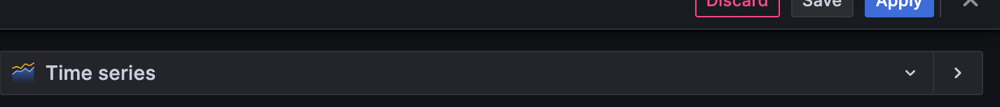
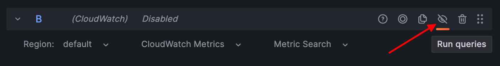
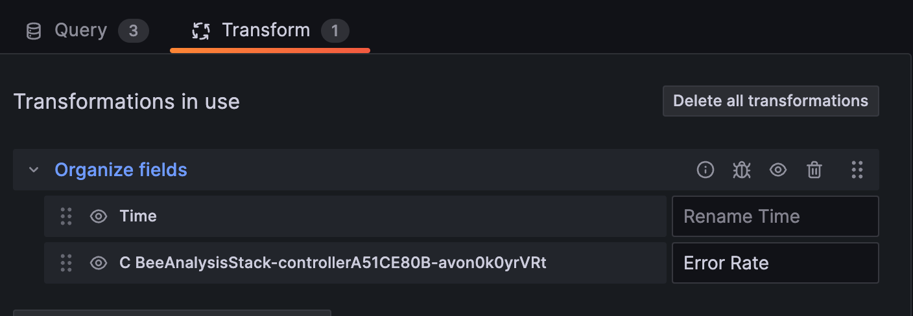
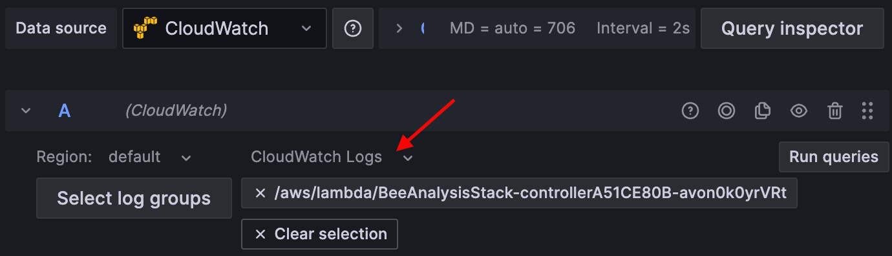
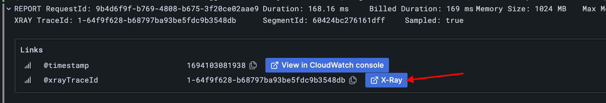
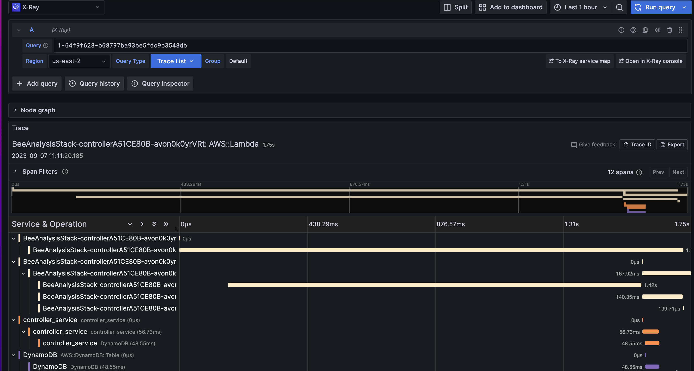

# Breakout 1: Observing AWS Workloads with Grafana, AWS CloudWatch, and AWS X-Ray

## Introduction

Building on your introduction to observability and Grafana from the previous presentation, this lab offers a practical opportunity to apply your knowledge. In this lab you will dive deep into understanding how to utilize [Grafana plugins](./supplementary_information/plugin_basics.md) to visualize data that is being stored in AWS today without having to move or duplicate the data. 

The Grafana Plugins that will be used in the first lab today are:

- [Amazon CloudWatch](https://grafana.com/grafana/plugins/cloudwatch/): Collects monitoring data, providing a holistic view of AWS resources, applications, and services, supporting setup of alarms, logs and metrics visualization, and automated troubleshooting actions.

- [AWS X-Ray](https://grafana.com/grafana/plugins/grafana-x-ray-datasource/): A tracing service enabling application analysis and debugging, illuminating user journeys across distributed system components.

## Prerequisites

- Ensure you have received your Grafana Cloud login details via email. Contact a Grafana Labs team member if you haven't.

## Objectives

By the end of this lab, you will be able to:

- Create a Grafana dashboard.
- Add and configure panels to visualize data from the Amazon CloudWatch and AWS X-Ray plugins.

## Scenario

You are a part of the DevOps/SRE team at FictionTech, which is in charge of overseeing a recommendations service integrated within the company’s website. This service aims to increase user engagement and sales by providing real-time, tailored product recommendations. You have been tasked with creating a dashboard to help the teams better understand this application's performance. Below is the architectural breakdown of the recommendations service:


1. **User Request**: Initiated from multiple sources including email listservs, the website, or other applications.
2. **Amazon API Gateway**: Receives requests, redirecting them to the appropriate AWS Lambda function.
3. **AWS Lambda**: Performs business logic, which entails storing data in DynamoDB and, under certain conditions, making API calls to a third-party recommendations ML model.
4. **Amazon DynamoDB**: Functions as the database for data storage and retrieval.
5. **Third-Party Recommendations ML Model**: Produces personalized product suggestions based on the received data.
6. **Response**: Outputs from DynamoDB or the recommendations ML model are returned to the user via the Lambda function and API Gateway.

## Lab Steps
### Part 1: Access Grafana Cloud Environment
For this workshop, a preconfigured Grafana Cloud stack is provided. Let's start by ensuring you can successfully log in to the instance.

```Step 1:``` Log into your Grafana instance by going to the Grafana website using URL, login and password credentials you were sent via email.


### Part 2: Creating a new Dashboard
In this lab you will create a new dashbaord and add a few panels to a dashboard that will provide a high-level overview of useful metrics that define the health and performance of the recommendations service.

```Step 1:``` In the upper left hand corner open up the Menu Bar by clicking on the Icon next to the word 'Home' -> 'Dashboards'


```Step 2:``` On the dashboard home page click 'New' -> 'New Dashboard'


```Step 3:``` In the dashboard on the upper right hand corner click on the 'Gear' button


```Step 4:``` Replace the field Name with "Recommendations Service - {Your Name}"

```Step 5:``` Click 'Save dashboard' on the top right hand corner

****Pro Tip: Even though we are creating dashboards from scratch today, a good place to start when onboarding a new data source into grafana is our [community dashboard search](https://grafana.com/grafana/dashboards). There are over 5000 different example dashboards available. As well when utlizing Grafana Cloud some data sources come with example dashboards out of the box. For instance for AWS Cloudwatch it has 5 dashboards available out of the box you can [optionally import](https://grafana.com/grafana/dashboards).*

### Part 3: Add a Panel to Show Lambda Invocation Status
Knowing the success rate of your Lambda functions provides a clear picture of the health of your processing component. A high failure or throttle rate may indicate issues that need immediate attention. In this graph we are going to visualize the invocation over time graphed with throttle events and errors.

If this is your first time using Grafana to create a dashboard [this guide](./supplementary_information/panel_walkthrough.md) will give you a brief overview of the panel UI. 

```Step 1:``` Click 'Add' -> 'Visualization'

```Step 2:``` Select *Cloudwatch* as the Data source

```Step 3:``` Select: 
    - *AWS/Lambda* for your Namespace
    - *Invocations* as your Metric name
    - *Sum* as your Statistic
    - For Dimensions select *FunctionName* and set it equal to *getRecommendations*

```Step 4:``` Scroll down and click `+ add query`


```Step 5:``` Select: 
    - *AWS/Lambda* for your Namespace
    - *Errors* as your Metric name
    - *Sum* as your Statistic
    - For Dimensions select *FunctionName* and set it equal to *getRecommendations*

```Step 6:``` On the right hand side ensure that the graph is set to 'Time series', if not click the drop down and select it.



```Step 7:``` On the right hand side change the Title of the graph to be "Total Invocations".

```Step 8:``` In the search bar type in "Line Width" and change the value to 2 

*[Click here](https://play.grafana.org/d/000000016/1-time-series-graphs?orgId=1) for inspiration on the modifications you can make to the timeseries panel.*

```Step 9:``` Press `Save` and then press 'Apply'

### Part 4: Add a Panel to Lambda Error Rate
In this graph we will explore how you can show the error rate as a stat panel for easy viewing.

```Step 1:``` Click 'Add' -> 'Visualization'

```Step 2:``` Select *Cloudwatch* as the Data source

```Step 3:``` Select: 
    - *AWS/Lambda* for your Namespace
    - *Invocations* as your Metric name
    - *Sum* as your Statistic
    - For Dimensions select *FunctionName* and set it equal to *getRecommendations*

```Step 4:``` Scroll down and click `+ add query`


```Step 5:``` Select: 
    - *AWS/Lambda* for your Namespace
    - *Errors* as your Metric name
    - *Sum* as your Statistic
    - For Dimensions select *FunctionName* and set it equal to *getRecommendations*

```Step 6:``` Scroll down and click add '+ expression'

```Step 7:``` Set the operation to *Math* and the expression to "$A/$B"


```Step 8:``` For the first two queries hit the 'eye' icon to hide the query



```Step 9:``` Click the 'Transform' tab

```Step 10:``` Click the drop down and select 'Organize fields'

```Step 11:``` Change the name of the non time field to "Error Rate"



```Step 12:``` On the right hand side set the graph type to be 'Stat panel'

```Step 13:``` On the right hand side change the Title of the graph to be "Lambda Controller Error Rate".

*[Click here](https://play.grafana.org/d/Zb3f4veGk/2-stats?orgId=1) for inspiration on the modifications you can make to the stat panel.*

```Step 14:``` Press 'Save' and then press 'Apply'

### Part 5: Add a Panel to Show Error Logs
In this part we will show you one option for presenting log data on a dashboard.

```Step 1:``` Click 'Add' -> 'Visualization'

```Step 2:``` Choose *CloudWatch*

```Step 3:``` Change the drop down from 'Cloudwatch Metrics' to 'Cloudwatch Logs'

```Step 4:``` Select the log group for 'getRecommendations'



```Step 5:``` Input in the query box 
```sql
fields @timestamp, @message, @xrayTraceId | 
filter @message like /ERROR/ | parse @message 'Failed' as cause |
 sort @timestamp desc |
 limit 20
```
```Step 6:``` On the right hand side set the graph type to be Log panel

Now what you will see are all of the error logs associated with this particular log group. This is a great way to quickly see what errors are occuring in your system. As well if you expand out the errors you will see links that will take you directly to the AWS X-Ray trace for that particular error or to the AWS CloudWatch Console.




## Conclusion/Next Steps

**Well done!** You've established a starting point for your organization to monitor the service performance. For additional dashboard ideas, [click here](./supplementary_information/visualization_ideas.md), and to explore different visualization styles within Grafana, [click here](./supplementary_information/visualization_inspiration.md). Once the dashboards are to your liking you may want to consider the following next steps to enhance your operation:

- **Dashboard Refinement**: Work with your teams to identify any essential metrics or insights that might be missing, and adjust the dashboard accordingly. Ensure it meets the needs of all stakeholders.

- **Testing**: Simulate high data rates or errors to verify the dashboard’s effectiveness in reflecting real-time issues.

- **Granular Alerting** - Utilize [Grafana's Unified Alerting](https://grafana.com/docs/grafana/latest/alerting/) to establish alert conditions, especially those spanning multiple data sources. This reduces the need for constant dashboard monitoring. As well allows you to get a more holistic view of potential issues. [Click here](./supplementary_information/alerting_ideas.md) to get ideas for example alerts. [Click here](https://grafana.com/docs/grafana/latest/alerting/set-up/) if you want to learn how to configure an alerts.

- **Performance Optimization** - Use monitoring insights to optimize the service's performance. Identify bottlenecks and rectify them.

- **Feedback Loop**: Maintain regular communication with teams using this dashboard, to ensure the dashboard stays relevant and actionable, adjusting it based on their feedback.
