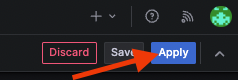
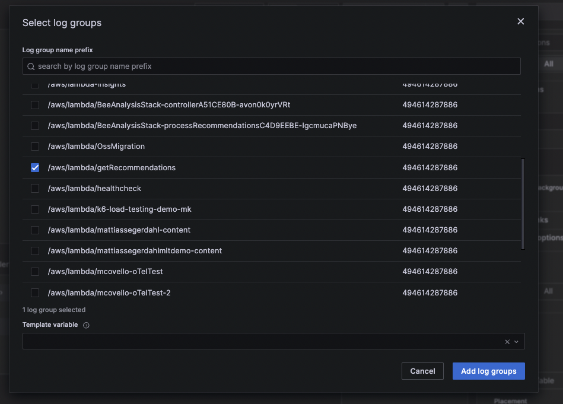

# Breakout 1: Observing AWS Workloads with Grafana, AWS CloudWatch, and AWS X-Ray

## Introduction

Building on your introduction to observability and Grafana from the previous presentation, this lab offers a practical opportunity to apply your knowledge. In this lab you will dive deep into understanding how to utilize [Grafana plugins](./supplementary_information/plugin_basics.md) to visualize data that is being stored in AWS today without having to move or duplicate the data. 

The Grafana Plugins that will be used in the first lab today are:

- [Amazon CloudWatch](https://grafana.com/grafana/plugins/cloudwatch/): Collects monitoring data, providing a holistic view of AWS resources, applications, and services, supporting setup of alarms, logs and metrics visualization, and automated troubleshooting actions.

- [AWS X-Ray](https://grafana.com/grafana/plugins/grafana-x-ray-datasource/): A tracing service enabling application analysis and debugging, illuminating user journeys across distributed system components.

## Objectives

By the end of this lab, you will be able to:

- Create a Grafana dashboard.
- Add and configure panels to visualize data from the Amazon CloudWatch and AWS X-Ray plugins.

## Scenario

You are a part of the DevOps/SRE team at FictionTech, which is in charge of overseeing a recommendations service integrated within the company’s website. This service aims to increase user engagement and sales by providing real-time, tailored product recommendations. You have been tasked with creating a dashboard to help the teams better understand this application's performance. Below is the architectural breakdown of the recommendations service:


1. **User Request**: Initiated from multiple sources including email listservs, the website, or other applications.
2. **Amazon API Gateway**: Receives requests, redirecting them to the appropriate AWS Lambda function.
3. **AWS Lambda**: Performs business logic, which entails storing data in DynamoDB and, under certain conditions, making API calls to a third-party recommendations ML model.
4. **Amazon DynamoDB**: Functions as the database for data storage and retrieval.
5. **Third-Party Recommendations ML Model**: Produces personalized product suggestions based on the received data.
6. **Response**: Outputs from DynamoDB or the recommendations ML model are returned to the user via the Lambda function and API Gateway.

## Prerequisites
- Ensure you have received your Grafana Cloud login details via email. Contact a Grafana Labs team member if you haven't.

## Lab Steps
### Part 1: Access Grafana Cloud Environment
For this workshop, a preconfigured Grafana Cloud stack is provided. Let's start by ensuring you can successfully log in to the instance.

```Step 1:``` Open your web browser and navigate to the Grafana instance URL that you were sent via email prior to the workshop

```Step 2:``` Press the **Sign in with Grafana.com** and enter the corresponding username and password


```Step 3:``` Click **Sign in**

### Part 2: Creating a New Dashboard
A dashboard gives you an at-a-glance view of your data and lets you track metrics through different visualizations. Dashboards consist of panels, each representing a part of the story you want your dashboard to tell. Every panel consists of a query and a visualization. The query defines what data you want to display, whereas the visualization defines how the data is displayed.

In this part, you'll learn how to create and set up a new Grafana dashboard. To learn more about Grafana's dashboarding capabilites [click here](https://grafana.com/docs/grafana/latest/fundamentals/dashboards-overview/).

```Step 1:``` In the upper left hand corner open up the Menu Bar by clicking on the Icon next to the word **Home** -> **Dashboards**


```Step 2:``` On the dashboard home page click **New** -> **New Dashboard**


```Step 3:``` In the dashboard on the upper right hand corner click on the **Settings** button


```Step 4:``` Replace the field Title with 'Recommendations Service - {Your Name}'


```Step 5:``` Click **Save dashboard** on the top right hand corner


```Step 6:``` Click **Save** again


    
**Note**: When organizations have one Grafana and multiple teams, they often want the ability to both keep things separate and share dashboards. You can create a team of users and then set RBAC permissions on folders and dashboards, and down to the data source level if you’re using [Grafana Enterprise or Grafana Cloud](https://grafana.com/pricing/).

******Pro Tip**: Even though we are creating dashboards from scratch today, a good place to start when onboarding a new data source into grafana is our [community dashboard search](https://grafana.com/grafana/dashboards). There are over 5000 different example dashboards available. As well when utlizing Grafana Cloud some data sources come with example dashboards out of the box. For instance for AWS Cloudwatch it has 5 dashboards available out of the box you can [optionally import](https://grafana.com/grafana/dashboards).*

### Part 3: Configure Your First Panel to Visualize Lambda Invocations
Visualizing AWS Lambda invocations in Grafana provides critical insights into the usage patterns, performance, and cost of your Recommendations Service. Monitoring Lambda invocations helps identify abnormal traffic patterns, optimize costs, and ensure your service is running smoothly. Now, let's set up a panel to track and analyze these invocations.

```Step 1:``` Click **Add** -> **Visualization**


```Step 2:``` Select *Cloudwatch* as the Data source


If this is your first time creating a Grafana dashboard [this guide](./supplementary_information/panel_walkthrough.md) will give you a brief walkthrough of the panel editing UI. 

```Step 3:``` Set up the query to fetch data on Lambda function invocations with the following parameters: 
    - **Region**: Choose *us-east-2* as the AWS region
    - **Namespace**: Enter *AWS/Lambda*
    - **Metric Name**: Select *Invocations*
    - **Dimensions**: Add *getRecommendations* as the Lambda function name
    - **Stat**: Select *Sum* to aggregate the total invocations


```Step 4:``` Click **Run queries**


```Step 5:``` On the right hand side of the screen press the *visualization list selection dropdown*


For more information about individual visualizations, refer to [Visualizations options](https://grafana.com/docs/grafana/latest/panels-visualizations/visualizations/).

```Step 6:``` Select *Stat* for the visualization type


```Step 7:``` Press the **Refresh** button


```Step 8:``` On the right hand side of the screen, set the *Title* to 'Lambda Invocations'


```Step 9:``` Click **Save**


```Step 10:``` Click **Apply**



**Note**: These panels are highly customizable. [Click here](https://play.grafana.org/d/Zb3f4veGk/2-stats?orgId=1) to see some customized stat panel examples.

### Part 4: Add a Panel to Lambda Error Rate
The next panel we create will show our Lambda Error Rate.

```Step 1:``` Hover over the upper right hand side edge of the *Lambda Invocation panel* and click the 3 dot icon.


```Step 2:``` Click **More** -> **Duplicate**


```Step 3:``` Hover over the upper right hand side edge of one of the *Lambda Invocation panel* and click the 3 dot icon. 


```Step 4:``` Select **Edit**


```Step 5:``` In the Datasource configuration section scroll down and click **+ add query**


```Step 5:``` Set up the query to fetch data on Lambda function invocations with the following parameters: 
    - **Region**: Choose *us-east-2* as the AWS region
    - **Namespace**: Enter *AWS/Lambda*
    - **Metric Name**: Select *Errors*
    - **Dimensions**: Add *getRecommendations* as the Lambda function name
    - **Stat**: Select *Sum* to aggregate the total invocations


The Errors metric in AWS Lambda tallies the number of invocations ending in error, aggregated per minute. This includes errors from unhandled exceptions in your code and Lambda runtime issues like timeouts and configuration problems. 

```Step 6:``` Scroll down and click add **+ expression**


```Step 7:``` Set the operation to *Math* and the expression to **$B/$A**

In order to calculate the error rate we must divide Errors by Invocations. To achieve this with the CloudWatch plugin we are referencing the previous queries we ran. The first query we ran was for Invocations and the second query we ran was for Errors. The CloudWatch plugin references the queries by letter. So the first query is referenced by A and the second query is referenced by B.


```Step 8:``` For the first two queries hit the **eye** icon. 

The eye icon in Grafana is used to hide (or show) a specific query result on a panel. Since the purpose of this panel is to show the error rate of the Lambda function we only want to show the last query in our panel and not the first 2.


```Step 9:``` Click the **Transform data**


The Transform tab in Grafana enables users to manipulate and modify data returned from a data source before visualization. Users can perform a variety of transformations, such as aggregating data points, filtering values, combining multiple queries, and reformatting data structures. These capabilities allow for more flexible and tailored visualizations, helping users derive meaningful insights from their data. [Click here](https://grafana.com/docs/grafana/latest/panels-visualizations/query-transform-data/transform-data/) to learn more.

```Step 10:``` In the search box type in 'Organize' and then select the option **Organize fields**


```Step 11:``` Change the name of the non-time field to 'Error Rate'


```Step 12:``` On the right hand side change the *Title* of the graph to be 'Lambda Error Rate'.


```Step 13:``` Type in 'Unit' in the *Search options* box


```Step 14:``` Set *Unit* to **Percent (0.0-1.0)**. 


Changing the unit on a Grafana panel affects how the data is displayed, making it easier to read and interpret. The unit does not change the underlying data; it only changes how the data is presented on the panel. In this case we changed it from the default number to percentage.

```Step 14:``` Search for 'Thresholds' field. Set the *Thresholds mode* to **Percentage**


```Step 15:``` Set for 'Thresholds' field. Change the value next to the red dot to '5'


```Step 16:``` Click **Save**


```Step 17:``` Click **Apply**


### Part 5: Show X-Ray Service Map
We will now add the service graph from X-Ray to our dashboard.

Next we will have the relevant error logs displayed on the dashboard. 

```Step 1:``` Click **Add** -> **Visualization**


```Step 2:``` Select *X-Ray* as your datasource


```Step 3:``` Click **Trace List** and select 'Service Map'


```Step 4:``` Set the *Region* to 'us-east-2' and *Group* to 'recommendation-service'.


```Step 5:``` On the right hand side of the screen press the *visualization list selection dropdown* and select *Node Graph* for the visualization type


```Step 6:``` Press the **Refresh** button. You should see a graph similar to the one below.


```Step 9:``` On the right hand side change the *Title* of the graph to be 'Service Map'.


```Step 10:``` Click **Save**


```Step 11:``` Click **Apply**


### Part 6: Add a Panel to Show Error Logs

Next we will have the relevant error logs displayed on the dashboard. 

```Step 1:``` Click **Add** -> **Visualization**


```Step 2:``` Select *CloudWatch* as your datasource


```Step 3:``` Change the drop down from *Cloudwatch Metrics* to *Cloudwatch Logs*


```Step 4:``` Set *Region* to 'us-east-2'


```Step 5:``` Click **Select log group**


```Step 6:``` Select the log group 'getRecommendations' and Click **Add log groups**



```Step 7:``` Replace the current query in the query box with the following query:
```sql
fields @timestamp, @message, xrayTraceId as @xrayTraceId
| filter level = "ERROR"
| sort @timestamp desc
| limit 20
```

```Step 8:``` On the right hand side of the screen press the *visualization list selection dropdown* and select *Logs* for the visualization type


```Step 9:``` On the right hand side change the *Title* of the graph to be 'Error Logs'.


```Step 10:``` Click **Save**


```Step 11:``` Click **Apply**


Now what you will see are all of the error logs associated with this particular log group. This is a great way to quickly see what errors are occuring in your system. As well if you expand out the errors you will see links that will take you directly to the AWS X-Ray trace for that particular error or to the AWS CloudWatch Console.

This linking between log and the corresponding trace happens automatically if the the log line contains the [@xrayTraceId field](https://grafana.com/docs/grafana/latest/datasources/aws-cloudwatch/#x-ray-trace-links).


## Conclusion/Next Steps

**Well done!** You've established a starting point for your organization to monitor the service performance. For additional dashboard ideas, [click here](./supplementary_information/visualization_ideas.md), and to explore different visualization styles within Grafana, [click here](./supplementary_information/visualization_inspiration.md). Once the dashboards are to your liking you may want to consider the following next steps to enhance your operation:

- **Dashboard Refinement**: Work with your teams to identify any essential metrics or insights that might be missing, and adjust the dashboard accordingly. Ensure it meets the needs of all stakeholders. [Click here](https://grafana.com/docs/grafana/latest/dashboards/build-dashboards/best-practices/) to learn about dashboarding best practices.

- **Testing**: Simulate high data rates or errors to verify the dashboard’s effectiveness in reflecting real-time issues.

- **Granular Alerting** - Utilize [Grafana's Unified Alerting](https://grafana.com/docs/grafana/latest/alerting/) to establish alert conditions, especially those spanning multiple data sources. This reduces the need for constant dashboard monitoring. As well allows you to get a more holistic view of potential issues. [Click here](./supplementary_information/alerting_ideas.md) to get ideas for example alerts. [Click here](https://grafana.com/docs/grafana/latest/alerting/set-up/) if you want to learn how to configure an alerts.

- **Performance Optimization** - Use monitoring insights to optimize the service's performance. Identify bottlenecks and rectify them.

- **Feedback Loop**: Maintain regular communication with teams using this dashboard, to ensure the dashboard stays relevant and actionable, adjusting it based on their feedback.

# STOP HERE... WE WILL HAVE ANOTHER PRESENTATION BEFORE WE BEGIN LAB 2
