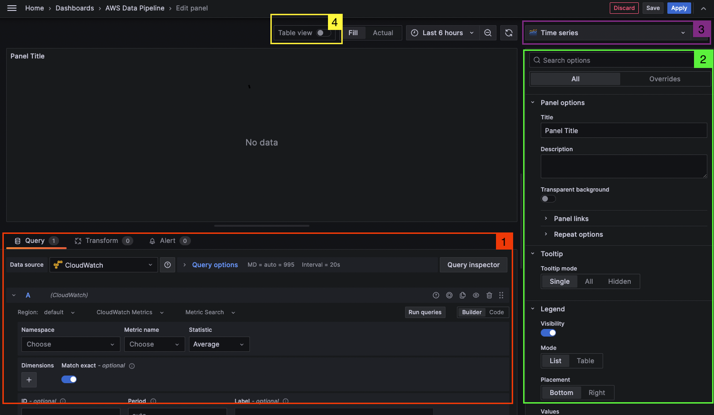

# Brief Walkthrough of the Grafana Panel UI
A Grafana panel is a visual representation of data that you can customize by defining a data source query, transforming and formatting data, and configuring visualization settings.

A panel editor includes a query builder and a series of options that you can use to transform data and add information to your panels.

1. (Red box) is where you will edit the actual data being used for the panel visualization. If you click on the [Transform](https://grafana.com/docs/grafana/latest/panels-visualizations/query-transform-data/transform-data/) tab you will be able to manipulate the data that is being returned from the query before the system applies a visualization.

2. (Green box) is where you will be able to fine tune how the visualization looks, whether that be changing the units of measurements, the color thresholds, and [so much more](https://grafana.com/docs/grafana/latest/panels-visualizations/configure-standard-options/). There is no shortage of options you can tweak here.

3. (Purple box) is where you will be able to select which [visualization](https://grafana.com/docs/grafana/latest/panels-visualizations/visualizations/) you want to use.

4. (Yellow box) allows you to toggle the data into a table view. This can be useful when you are manipulating the data being returned.
