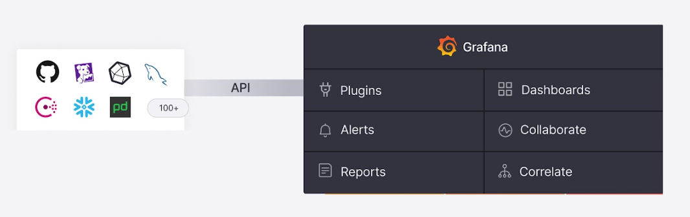

# Overview of Grafana Data Source Plugins
Grafana [data source plugins](https://grafana.com/docs/grafana/latest/datasources/) do not force you to move your data instead they allow you to query the data without moving it. 

Grafana provides a rich selection of data source plugins that enable seamless connections to various databases, APIs, and cloud services. Some common ones we find people use with their AWS workloads include:

- Metrics: [Prometheus](https://grafana.com/grafana/plugins/prometheus/), [Amazon Timestream](https://grafana.com/grafana/plugins/grafana-timestream-datasource/), [AWS CloudWatch](https://grafana.com/grafana/plugins/cloudwatch/)
- Logs: [Amazon OpenSearch](https://grafana.com/grafana/plugins/grafana-opensearch-datasource/), [AWS CloudWatch](https://grafana.com/grafana/plugins/cloudwatch/)
- Databases: [PostgreSQL](https://grafana.com/grafana/plugins/postgres/), [MySQL](https://grafana.com/grafana/plugins/mysql/), [SQL Server](https://grafana.com/grafana/plugins/mssql/), [ODBC](https://grafana.com/grafana/plugins/grafana-odbc-datasource/)
- Traces: [AWS X-Ray](https://grafana.com/grafana/plugins/grafana-x-ray-datasource/)
- Data Warehousing: [Amazon Redshift](https://grafana.com/grafana/plugins/grafana-redshift-datasource/), [Snowflake](https://grafana.com/grafana/plugins/grafana-snowflake-datasource/)
- Datawarehouses: [Amazon Athena](https://grafana.com/grafana/plugins/grafana-athena-datasource/), [Amazon Redshift](https://grafana.com/grafana/plugins/grafana-redshift-datasource/)
- General: [JSON, CSV, XML, GraphQL and HTML endpoints](https://grafana.com/grafana/plugins/yesoreyeram-infinity-datasource/), [Google Sheets](https://grafana.com/grafana/plugins/grafana-googlesheets-datasource/)
- IoT: [AWS IoT Sitewise](https://grafana.com/grafana/plugins/grafana-iot-sitewise-datasource/), [AWS IoT TwinMaker App](https://grafana.com/grafana/plugins/grafana-iot-twinmaker-app/)

Grafana has [over 170 plugins available](https://grafana.com/grafana/plugins/) that you can leverage out of the box as well you can write your own plugins if none of the existing ones suite your needs. This versatility allows you to integrate data from workflows regardless if they are hybrid, multicloud, or all running in one place into a first pane of glass.

To configure the plugins you simply follow the steps outlined on the plugins page for that particular datasource. You typically have a few options for how you want to connect to that datasource such as via api key, credentials, etc. It will all depend on the datasource you are configuring.

If you want to leverage a database directly using the cloud version of Grafana we often find customers will leverage [private data source connect](https://grafana.com/docs/grafana-cloud/connect-externally-hosted/configure-private-datasource-connect/) so they can do so without exposing the database to the internet.
