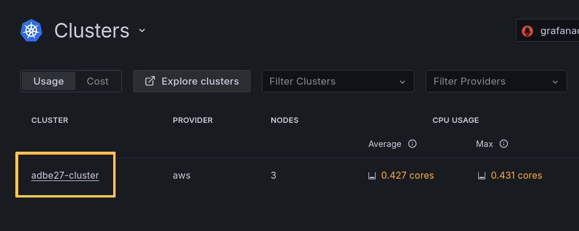
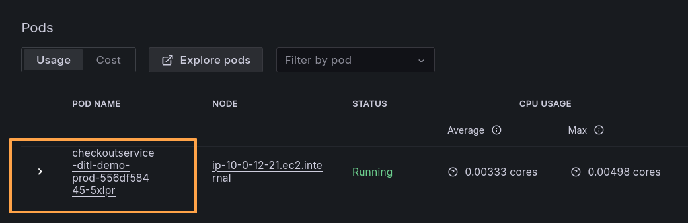

# Breakout 2: Monitoring with the Grafana Cloud AWS integration

## Introduction

The goal of this lab is to guide you through visualizing and monitoring your systems using the Grafana Cloud AWS integration and Grafana Cloud Metrics.

As you have just learned, there are two primary ways to send your telemetry data from your AWS account to Grafana Cloud backends:

- Direct installation of an agent onto your server (i.e., Amazon EC2 or Amazon EKS).

- Or, collect your data via the AWS Integration, which lets you connect and pull your AWS CloudWatch metrics into Grafana Cloud, without deploying or installing individual agents or configurations.

## Section 1: Shipping from Infrastructure Directly
To ship from infrastructure directly, you will install an agent onto your server. We often find customers installing the agent on their workloads running on Amazon Elastic Compute Cloud (EC2), Amazon Elastic Container Service (ECS), and Amazon Elastic Kubernetes Service (EKS) on EC2, AWS Fargate, and AWS Lambda, as well as on-premises.

This allows you to have fine-tuned control over what telemetry data you are shipping; for example, you may want to reduce the metrics enabled by default in certain exporters, or you may want to add particular labels to your metrics and traces that tell you the region and environment the telemetry data is coming from, or you may not want to send logs only at a particular path. Installing an agent directly on the machine eliminates the variability of naming schemas between vendors, what metrics they surface, etc., allowing you to create consistency across accounts, cloud providers, and on-premise. 

Let's take a look at this in action!

### 1.1: Monitoring Kubernetes clusters
In this first activity, you will use data being collected from an application running on Kubernetes, specifically Amazon Elastic Kubernetes Service (EKS). 

To ship telemetry from your own Kubernetes clusters, you can follow the guides in Grafana Cloud's **Integrations** catalog. Grafana Cloud Integrations bundle Grafana Alloy configuration, tailored Grafana dashboard experiences, and best-practice alerting defaults for common observability targets like Linux hosts, databases, Kubernetes clusters and NGINX servers. Today, around 100 different technologies can be observed using integrations, and we are continually expanding that catalog.

Integrations are a cloud-only feature; however, you can leverage the [k8s mixin](https://github.com/kubernetes-monitoring/kubernetes-mixin) in the OSS version to achieve something similar.

For this lab, we already installed Grafana Alloy into our EKS cluster using the [Kubernetes Monitoring Helm chart](https://grafana.com/docs/grafana-cloud/monitor-infrastructure/kubernetes-monitoring/configuration/helm-chart-config/helm-chart/). Once Alloy is installed, your telemetry data will be available to query using PromQL, LogQL, and TraceQL.

In the first part of this lab, we'll dive into the Kubernetes app experience, which is streamlines the management of your Kubernetes environments. The app helps with both reactive problem solving and proactive management, ensuring smoother operations and better resource optimization.

1.  Navigate to the Grafana Cloud instance you were provided with at the start of the workshop.

1.  In the upper left-hand corner, open the Menu Bar by clicking on the Menu/Burger icon next to the word **Home**. In the main menu, expand **Infrastructure**, then click **Kubernetes**.

    The Kubernetes Overview page will be shown:

    

    Kubernetes Overview acts as your starting point for understanding the operational & infrastructure health of your Kubernetes environments. The most critical issues and alerts from all of your clusters are bubbled up into this view. 

    You can see the graphed counts for Clusters, Nodes, Pods, and containers, as well as CPU usage, memory usage, pod and container alerts.

1.  Now let's dive into a single cluster. From the left hand menu click **Infrastructure &rarr; Kubernetes &rarr; Clusters**.

1.  From here, click on the single **cluster** in the list:

    

    The cluster view is displayed. From here, you can see all of the details of this Kubernetes cluster, which is an Elastic Kubernetes Service (EKS) cluster on AWS. 
    
    You can see cluster details like:

    - provider (AWS)
    - nodes
    - CPU and memory usage
    - disk

1.  Scroll down to the nodes list and choose a **node** in the cluster:

    

1.  Now we see the Node view, which shows us all the details of this node in the cluster, some aggregated metrics, and all of the Pods running on the Node:

    

1.  We've seen metrics from our Kubernetes cluster's infrastructure layer. Now let's take a look at some of the workloads running on our cluster. From the sidebar, click on **Infrastructure &rarr; Kubernetes &rarr; Workloads**

    The Workloads view will be displayed. We can see all our workloads, across all clusters.

1.  From the Workloads view, click on the workload that starts with the name `checkoutservice`:

    

    The workload view will be displayed.

1.  From the `checkoutservice` workload view, we can see aggregated metrics of this workload, from the infrastructure layer. We can see CPU, memory usage and cost.

    

1.  Scroll down to the list of Pods at the bottom of this page and click on the Pod name to drill into it:

    

1.  In the Pod view, you can see the CPU and memory usage of this Pod. We can also view Logs from the Pod.

    You can also view performance over time, such as usage over the last year, six months, 90 days, etc.

    

1.  At the top right-hand corner, change the timeframe from `Last 1 hour` to the `Last 2 days`.

    

    Notice how we can view the health of this pod over the last 2 days.

[Click here](https://grafana.com/docs/grafana-cloud/monitor-infrastructure/kubernetes-monitoring/navigate-k8s-monitoring/) if you want to learn more about what is available with the Kubernetes Integration.

Next we'll look at how we can observe application-level metrics from the services that are deployed in our Kubernetes cluster.

### 1.2: Application Observability

In our demonstration EKS cluster, we have instrumented our applications to collect and send OpenTelemetry traces to Grafana Cloud. This enhances our observability picture by allowing us to see health at the application layer, through metrics, logs and traces.

1.  From the side menu in Grafana, click on **Application** to navigate to Application Observability.

    The Application Observability home page is displayed. This gives us a complete picture of our application health, with metrics derived from OpenTelemetry traces, which gives us information on:

    - Request duration trends
    - Error rate
    - Request rate

1.  From here, click on _checkoutservice_ to drill into it:

    

1.  Now, we can view application health for our Checkout service. On this page, you will see the RED metrics (rate, error, duration) associated with this service. 

    

    Scroll down the page to view the operations of this service, and associated services.

1.  Return to the top of the page and click on the **Service Map** tab. This depicts the relationship between our services, as well as allowing us to dive into service-specific logs and traces.

    

The advantage of using Grafana backends in hybrid environments becomes apparent when using these types of dashboards; this is because you can leverage the same dashboards, alerts, and flows for similarly hosted workloads regardless of whether they are in the cloud or on-premise since you are emitting consistent telemetry data from each environment.

## Section 2: AWS Observability
Sometimes, installing an agent on AWS services is not possible. This is true for many AWS cloud services. 

This is where AWS Observability for Grafana Cloud comes in. AWS Observability allows you to connect and pull AWS CloudWatch metrics, and logs, into Grafana Cloud, without deploying or installing any local exporters or agents. You need to only connect to your AWS account via the Grafana Cloud UI, and Grafana Cloud does the rest.

Once you initialize the AWS Observability integration, data will be collected from your AWS account into your Grafana Cloud telemetry databases.

**In this lab environment, we have already configured Grafana Cloud's AWS integration for you. If you want to see how to configure it in your own environment, jump to the appendix at the end of this document.**

### Exploring data collected from CloudWatch
A common use case for Grafana Cloud's AWS integration is to monitor Managed AWS Services.

In this lab part, we will look at the **AWS Observability app** in Grafana Cloud, which helps you monitor your AWS managed services, without the need for local agents, exporters, or instrumentation libraries.

1.  In the upper left-hand corner, open up the Menu Bar by clicking on the Menu/Burger icon next to the word **Home** -> **Cloud provider** -> **AWS**:

    

1.  From the AWS screen, click on the dashboard icon by **AWS Lambda**:

    

1.  The AWS Lambda screen shows us a view of all the Lambda functions from our AWS Account.

    

1.  Click on the dropdown labelled **Function name** and choose **getRecommendations**. Now we see some high-level RED metrics for our 'getRecommendations' Lambda function.

    

    The real power comes when we create tailored dashboards. To start this, you can easily examine the underlying query and add it to your custom dashboards.

1.  Let's explore the underlying data, and see how to add a panel to a custom dashboard.

    In the **Function name** dropdown, make sure you've got **getRecommendations** selected.

    Then, hover over the upper right-hand side of one of the dashboard visualizations. Then click on the **three dots** and select **Explore**.

    

    You should now be able to see the underlying query that makes up this panel - this is PromQL, the Prometheus query language. We're using PromQL to query our Grafana Cloud Metrics data source directly, as it now contains CloudWatch metrics that are being pulled from AWS, thanks to the AWS integration. 

    For example, the "invocations" sum from CloudWatch is stored as `aws_lambda_invocations_sum` with the Grafana AWS Integration:

    

1.  Now, if we want to add this to a dashboard, we could do it straight from this screen by selecting **Add** -> **Add to dashboard**. Then, you choose which dashboard to which you want to add this query, and voila!

    

### Using Grafana as your single pane of glass
Grafana can query multiple data sources simultaneously. This means you can combine data from various AWS services (like CloudWatch, Elasticsearch, and AWS X-Ray) and other sources (like Prometheus or SQL databases) into a single dashboard for a unified view of your infrastructure and applications.

By centralizing observability data, providing pre-built dashboards and alerts, and allowing you to visualize data from your other backends, Grafana Cloud helps you reduce the time it takes to troubleshoot problems in your AWS environment.

See [this blog](https://grafana.com/blog/2022/06/06/grafana-dashboards-a-complete-guide-to-all-the-different-types-you-can-build/) to learn more about the different types of dashboards you can build with Grafana.

## STOP HERE... END OF LAB 2

This is the end of the lab! Read on to find out how to set up the AWS integration in own environment with your own AWS account.

## Appendix: Setting up the AWS integration

**Note: The configuration of the AWS integration has been done for you already. You don't need to complete the following section. Read on to find out how to set up the CloudWatch integration in your own environment.**

AWS integration setup (for your information only - you don't need to complete this task):

1.  Go to AWS &rarr; Configuration. 

1.  Create a new role in AWS. This can be done automatically via CloudFormation, or you can do so manually.

    

1.  Input the connection details to your AWS account. These will be outputs in the CloudFormation stack or you can find them in the AWS console.

    

    *****Note:** *you can optionally include your AWS Resource Tags in the data sent to Grafana Cloud (e.g. env, application). Tags will appear as labels on the exported metric with a tag_ prefix. [Click here](https://docs.aws.amazon.com/tag-editor/latest/userguide/tagging.html) to learn more about the benefits of tagging your AWS resources if you do not already.*

1.  Next, you will configure which services you want to pull metrics from and what metrics/aggregates you want to ingest.

    

1.  Once you have configured what metrics to scrape, press 'Create Scrape Job' and Grafana will begin pulling in your metrics... it's that easy!

    

    You can create any number of job configurations dictating which services, regions, and AWS accounts to collect metrics/logs from. 

### How it works

Keep in mind what you are configuring here is pulling in CloudWatch data into Grafana Mimir (Prometheus) and Grafana Loki (Prometheus but for logs) – allowing users to interact with and explore this data using the same query language, dashboards, alerts, etc. This provides a consistent way for end users to query their data and reduces the cost variability with querying/surfacing metrics and logs from the [CloudWatch API](https://aws.amazon.com/cloudwatch/pricing/) via the Plugin (lab 1).

Once the data is in the Grafana Cloud telemetry backend, there are no additional fees associated with querying, using dashboards, or running alerts against the data that’s been collected. The CloudWatch metrics integration installs prebuilt dashboards in your Grafana Cloud instance to help monitor your system. 

**That's it - thank you for participating!**

For more information about AWS observability in Grafana Cloud, visit: https://grafana.com/solutions/cloud-monitoring-aws/

