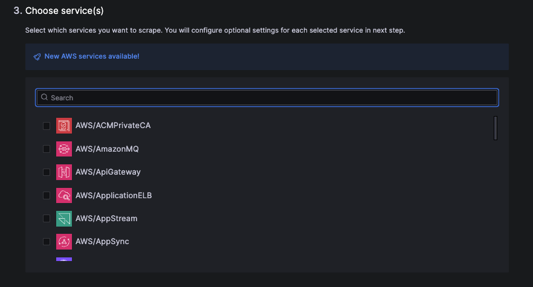

# Breakout 2: Leveraging Prometheus Style Telemetry Data Stores with OpenTelemetry

## Introduction

The goal of this lab is to guide you through visualizing and monitoring your systems using Grafana Metrics, Logs, and Traces using the Cloud Watch Integration and Grafana Agent in Grafana Cloud.

As you have just learned there are two primary ways to send your Telemetry data from your AWS account to Grafana backends. One being via the direct installation of an agent on to your server (ie Amazon EC2 or Amazon EKS). The other option being to ship your data via the AWS Integration which lets users connect and pull their AWS CloudWatch metrics into Grafana Cloud without having to deploy or install any local agents or configurations.

## Section 1: Ship from Infrastructure Directly
In order to ship from infrastructure directly you will simply install an agent onto your server. We often find customers installing the agent on their workloads runnning on Amazon Elastic Compute Cloud (EC2), Amazon Elastic Container Service (ECS), and Amazon Elastic Kubernetes Service (EKS) on EC2, AWS Fargate, and AWS Lambda, as well as on-premises.

This allows you to have fine tune control over what telemetry data you are shipping for example you may want to reduce the metrics enabled by default in certain exporters, or you may want to add particualr labels to your metrics and traces that tells you the region and environment the telemetry data is coming from, or you may not want to send logs only at a particualar path. By shipping data directly off of the machine itself you are able to create consistency across account, cloud providers, and onpremise. 

Lets take a look at this in action!

### Hands on - Using, Migrating, and Creating Dashboards in Kubernetes Monitoring
In this first activity we will be referencing data from Amazon Elastic Kubernetes Service (EKS). 

You have alot of options when it comes to deploying the Grafana Agent on Kubernetes. For example you can run the agent as a centralized collection service (K8s StatefulSets), as a host daemon (K8s DaemonSets), or as a container sidecar. 

[Click here](https://grafana.com/docs/agent/latest/flow/setup/deploy-agent/#deploy-grafana-agent) to learn about the pros and cons of each. In this case we installed the agent using Helm. Once the Agent is installed, your telemetry data will be available to query using PromQL, LogQL, and TraceQL.

The Grafana Cloud Integrations bundle Grafana Agent, tailored Grafana dashboards, and best-practice alerting defaults for common observability targets like Linux hosts, databases, and NGINX servers. Currently, there are roughly 100 different technologies that can be observed out of the box with our integrations, and we are and we are continually expanding that catalog.

Grafana Integrations make it possible to achieve a Fast Time to Value
You can think of integrations as the easy-button, it bundles exporters, the Grafana Agent, dashboards, and alerting for common systems such as linux, k8s, sql, etc. Integrations is a cloud only feature however you can leverage the [k8s mixin](https://github.com/kubernetes-monitoring/kubernetes-mixin) in the OSS version to achieve something similiar. You can also recreate these dashboards or export them, all of the basic metrics are available you will just have to copy over the relabels in the Grafana Agent configuration and change the remote_write from being a cloud instance to a self managed instance.

1\. Navigate back to your Grafana Cloud Account

2\. In the upper left hand corner open up the Menu Bar by clicking on the Icon next to the word **Home**

3\. Then click **Dashboards**

4\. Click "Integration - Kubernetes"

5\. Click "Kubernetes / Compute Resources / Cluster"

6\. Notice you can adjust what renders on the page with the dropdown variables

7\. Additionally, you can change the timeframe for which the dashboard renders data. Try changing it to the last 12 hours. 

8\. You can click and drag on the graph to zoom back into particular timeframes that look of interest

9\. Next we will drill down into one of our Namespaces. Under CPU Quota click on the Namespace = "otel-demo-obscon"

10\. In the Pod overview menu feel free to further drill down into any of the pods showing

The advantage of using Grafana backends in hybrid environments becomes apparent when using these types of dashboards, this is because you can leverage the same dashboards, alerts, and flows for simliar workloads regardless of if they are in the cloud or onpremise.

If you want to learn more about what is all avaiable with the Kubernetes Integration [click here](https://grafana.com/docs/grafana-cloud/monitor-infrastructure/kubernetes-monitoring/navigate-k8s-monitoring/).

## Section 2: Ship from CloudWatch
Sometimes installing an agent on AWS services is not possible. This is true for many AWS Managed Services. The idea is that they are managed so your burden of responsibliyt shifts when it comes to observing your applications. 

This is where the AWS integration comes in. The AWS integration type lets users connect and pull their AWS CloudWatch metrics into Grafana Cloud without having to deploy or install any local agents or configurations. Users only need to connect to their AWS account via the Grafana Cloud UI. 

*** Note: for the purpose of this lab, we have already done these step so data would be available for you to query. Once you setup the integration data begins to flow from that point forward into your Grafana Cloud telemetry databases.

To set up this integration, it only takes three steps after you select what type of telemetry you would like to gather.

Step 1: Create a new role in AWS. This can be done automatically via CloudFormation or you can do so manually.

Step 2: Input the connection details to your AWS account

Step 3: Create scrape job

Step 4: Configure service settings

You can optionally include your AWS Resource Tags in the data sent to Grafana Cloud (ex, env, application). Tags will appear as labels on the exported metric with a tag_ prefix. 

You can create can create any number of job configurations dictating which services, regions, and AWS accounts to collect from within the AWS Integration. This enables you to logically split your data into specific jobs and scrape any number of AWS accounts to better organize your data.

All of the data pulled via the Integration is stored in Mimir (Prometheus) and Loki (Prometheus but for logs) – so users interact with and explore this data using the same query language they would use if they were to install the agents directly on the machines (such as in part 1). 

This provides a consistent way for your end users to query their data as well  reduces the cost variablity with querying/surfacing metrics and logs from the CloudWatch API via the Plugin (lab 1).

Once the data is in the Grafana Cloud telemetry backends there are no additional fees associated with querying, using dashboards, or running alerts against the data that’s been. The CloudWatch metrics integration installs prebuilt dashboards in your Grafana Cloud instance to help monitor your system. Lets explore the EC2 dashboard.

### Hands on 
1. Click the VIEW DASHBOARDS button to see available dashboards.
   
2. Choose a dashboard, lets start with EC2.
   

This is what your EC2 dashboard should look like. 

3. Take one of the panels from your dashboard into explore mode by clicking the three dots in the upper right-hand corner.

   
4. Now you can see the underlying query that makes up this panel - this is PromQL! 

**** Note: today the AWS integration only supports metrics and logs, you would have to have another method to ingest traces, as well all jobs have a scrape interval of 5m minutes and is currently not configurable. This is not the case for all other integrations. This is under active development more exciting features are coming soon.

### Part 3: Unified Monitoring with Grafana - The First Pane of Glass
Grafana can query multiple data sources simultaneously. This means you can combine data from various AWS services (like CloudWatch, Elasticsearch, and AWS X-Ray) and other sources (like Prometheus or SQL databases) in a single dashboard for a unified view of your infrastructure and applications.

By providing a centralized and unified view of your AWS observability data, Grafana telemetry backends can help you to improve the operational efficiency of your team. By centralizing observability data and providing pre-built dashboards and alerts, Grafana telemetry backends can help you to reduce the time it takes to troubleshoot problems in your AWS environment.

See [this blog](https://grafana.com/blog/2022/06/06/grafana-dashboards-a-complete-guide-to-all-the-different-types-you-can-build/) to learn more about the different types of dashboards you can build with Grafana.

# STOP HERE... END OF LAB 2