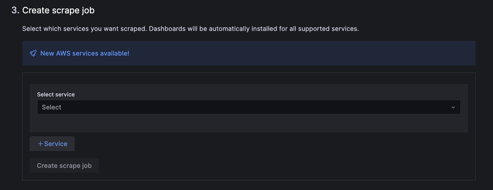

# Breakout 2: Leveraging Prometheus Style Telemetry Data Stores with OpenTelemetry

## Introduction

Building on the concepts thus far, this lab provides a hands-on experience to explore various options for shipping telemetry data out of AWS to Grafana Cloud.

In lab 1 we discussed the CloudWatch plugin, which enables you to query both metrics and logs straight from the CloudWatch API. If you're using AWS, you're almost certainly using Amazon CloudWatch to collect and analyze observability data from your workloads. And while AWS remains the most broadly adopted cloud platform, not every company uses it exclusively, which means you need a tool that can standarized and give you a centralized view across all your environments.

In this lab, we will explore two popular options for shipping telemetry data out of AWS to Grafana. One being a fully managed option the other being through an open source agent you deploy and manage.

## Objectives
By the end of this lab, you will be able to:

- Select and implement the optimal telemetry data shipping method tailored to your specific requirements.
- Achieve enhanced observability, leading to more effective monitoring and quicker, data-driven decision-making.

## Prerequisites
- Ensure you have received your Grafana Cloud login details via email. Contact a Grafana Labs team member if you haven't.

## Emitting and Collecting Telemetry Data Primer

Instrumenting your applications to emit telemetry is crucial for gaining insights into their performance and behavior. 

Prometheus exporters, are known for their simplicity, efficiency, and vendor-agnostic nature, offer a straightforward way to collect metrics from various services. Meanwhile, OpenTelemetry, a collaborative project under the Cloud Native Computing Foundation (CNCF), offers a vendor-neutral and community-driven framework for instrumenting your applications, making it easier to achieve seamless observability across diverse environments and languages. To learn more about emitting telemetry data [click here](https://opentelemetry.io/docs/concepts/observability-primer/).

Once you have your applications exposing telemetry data you can collect it. Telemetry often relies on software agents running on the source systems to gather the data. These agents then forward the data to a centralized telemetry backend, where it is stored and analyzed.

There are many different ways you can choose to ship your telemetry data to our backends, but two popular option we see our customers choosing from are the [Grafana Agent](https://grafana.com/oss/agent/) and the [OpenTelemetry Collector](https://opentelemetry.io/docs/collector/). 

The Grafana Agent is an open-source telemetry collector designed to collect metrics, logs, and traces. It's compatible with Prometheus, Loki, and Tempo telemetry stack, ensuring reliability. The Grafana Agent can forward metrics to Prometheus-compatible endpoints, logs to Loki-compatible endpoints, and traces to OpenTelemetry-compatible endpoints.

This approach is advantageous because a single agent can efficiently capture multiple telemetry data types—metrics, logs, traces, and profiles—and route them to various telemetry backends. This unified method is particularly beneficial for maintaining a cohesive observability strategy across all infrastructure components, whether located on-premises or in the cloud.

When thinking about the biggest differentiation aspect between the Grafana Agent and the OpenTelemetry collector it is support. In terms of support, the Grafana Agent offers direct assistance, enabling faster issue resolution and feature development. This level of support is not available with the OpenTelemetry Collector, which relies on upstream maintainers for issue handling without guaranteed timelines. There are many other advantages of using the Grafana Agent specifically such as native Prometheus pipelines, enabling consolidating OTel and Prometheus pipelines on one single data collection solution.

For the purposes of this lab we will be focused on the Grafana Agent, but you can achieve the same results shown in the lab with the Open Telemetry collector, which will be out of scope for this lab.

## Lab Steps

### Part 1: Shipping Telemetry Data via Open Source Agent
The install guides [found here](https://grafana.com/docs/agent/latest/flow/setup/install/). 

We will be referencing data from ECS Fargate in this lab, and there are several ways to install the Grafana Agent on ECS Fargate. This can be achieved as a sidecar, in your Fargate instance directly, or as an ECS task. Once the Agent is installed your telemetry data will be avaiable to query.

Let’s take a quick look at the data we are gathering from our Fargate cluster. 
1. On your side menu, navigate to explore. 

2. Set the data source to grafanacloud-awsworkshop-logs and paste the following query into the editor:
{job="varlogs", filename="/var/log/ecs/ecs-agent.log"} |= `` | logfmt

This query will return some of the ecs logs

3. Next, Set the data source to grafanacloud-awsworkshop-prom. 
Choose the label "instance" from the query builder, and choose a corresponding IP to go along with it. 
Next choose a metric that is available for this label. All of these  metrics are what we are collecting for our ECS Fargate Clusters.

### Part 2: Grafana Cloud Integrations 

Grafana Cloud is designed to be user-friendly, making it accessible even for those who are new to observability practices. The Grafana Cloud Integrations bundle Grafana Agent, tailored Grafana dashboards, and best-practice alerting defaults for common observability targets like Linux hosts, databases, and NGINX servers. Currently, there are roughly 100 different technologies that can be observed out of the box with our integrations, and we are and we are continually expanding that catalog. In the case of monitoring specific infrastructure changing the location that the agent sends to is very simple. Lets say you wanted to change the configuration file to write to your OSS Tempo. For most integrations such as the Kubernetes monitoring or Linux you would simply change the remote_write destination.

Now, you can use Grafana Cloud to connect over 60 of the most popular AWS services, including EC2, Lambda, EBS, RDS, S3, ECS, ELB, and Billing. We’ve also improved how you interact with those services in our cloud by giving you one portal to set up and manage your AWS observability strategy. 

To setup the integration you simply follow a few steps in the Grafana Cloud UI no need to install anything directly on any EC2 instances, kubernetes clusters, etc. 

*** Note: for the purpose of this lab, we have already done these step so data would be available for you to query. Once you setup the integration data begins to flow from that point forward into your Grafana Cloud telemetry databases.

To setup this integration it only takes 3 steps after you select what type of telemetry you would like to gather

Step 1: Create a new role in AWS. This can be done automatically via cloudformation or you can do so manually.

Step 2: Input the connection details to your AWS account

Step 3: Create scrape job

Within the integration, you can create any number of job configurations dictating which services, regions, and AWS accounts to collect from. This enables you to logically split your data into specific jobs and scrape any number of AWS accounts to better organize your data. [Click here](https://grafana.com/blog/2023/08/29/centralize-aws-observability-with-grafana-cloud/) to learn more about this integration.

**** Note: today the AWS integration only supports metrics and logs, you would have to have another method to ingest traces, as well all jobs have a scrape interval of 5m minutes and is currently not configurable. This is not the case for all other integrations. 

Thats it! Once we have this installed the telemetry data will be shipped to Grafana Cloud and you will be able to query it with PromQL as well as have various out of the box dashboards avaiable to you.

### Part 3: Pulling it all Together
OK but when do we use each? Let say we want to add on to our example from before 
k8s app that calls this service... 

1. Navigate to Dashboards on your side menu.

2. Open the dashboard named "Serverless" . This dashboard provides an overview of the serverless infrastructure, including the health, addition of new services, pods, clusters, lambda functions, an instances.

3. The Fargate portion of this dashboard includes data from the Grafana Agent and the lambda portion of the dashboard brings in data from the Cloudwatch plugin that we learned about earlier in the lab. Take a moment to explore the various panels in the dashboard!

#Debug Workflow
When reviewing the serverless dashboard, did you notice issues with our services?
We are experiencing high errors in our lambda functions and a sudden spike in Pods running within our Fargate Clusters. 
Lets step through and debug this. 

1. Since we are seeing a high amount of errors with our lambda functions, let's take the "Errors per function [count/sec] into explore mode.

2. Next, split the screen. Our data source will still be Cloudwatch, but we want to change from Cloudwatch metrics to Cloudwatch logs as shown in the screenshot below.

 

4. Now we need to choose our log groups. Click the "select log groups" button. Then type "/aws/lambda" in the search bar. 
You will want to choose the following log groups:
/aws/lambda/items /aws/lambda/batch-migration-function /aws/lambda/aws_config_bucket_events
When complete click the "Add Log Groups Button" 

5. Paste the following query into the Cloudwatch logs query interface in Grafana:
fields @timestamp, @message |
 sort @timestamp desc |
 limit 200

6. Next, let's be sure our views across both Cloudwatch Metrics and logs are Synced across the same time range by clicking the sync button.

7. Then, zoom into a time range when you see a spike in errors in your metrics, the logs will automatically adjust to the same time range as you update your metrics.

8. Now, we can have a look at our logs to see if there are any errors and what specifically is causing those errors.

   
10. Next, we should be sure to look at our Fargate cluster to ensure it is not impacted. Lets close the CloudWatch Logs Split pane.

11. Now Split the explore view again. and this time, choose the datasource "grafanacloud-awsworkshop-prom"

12. Paste the following PromQL query into the Query Editor. This Query provides a count of the label "event" in our fargate cluster.
count by(event) (prometheus_sd_kubernetes_events_total{agent_hostname="ip-10-0-1-213.ec2.internal"})

14. After pasting the query, run the query.

14. Next, we will want to change our graph type since the query returns multiple values. Let's use Stacked Bars.

   
   
16. When digging into this, it does look like we do have some delete actions happening in our cluster as well!

17. Zooming out to the main dashboard, it looks like those delete actions are correlated with what is happening in our application!

    
