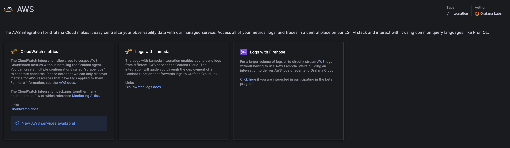

# Breakout 2: Leveraging Prometheus Style Telemetry Data Stores with OpenTelemetry

## Introduction

Building on the concepts thus far, this lab provides a hands-on experience to explore various options for shipping telemetry data out of AWS to Grafana Cloud.

In lab 1, we discussed the CloudWatch plugin, which enables you to query metrics and logs straight from the CloudWatch API. If you're using AWS, you're almost certainly using Amazon CloudWatch to collect and analyze observability data from your workloads. While AWS remains the most broadly adopted cloud platform, only some companies use it exclusively, which means you need a tool that can standardized and give you a centralized view across all your environments.

In this lab, we will explore popular options for shipping telemetry data from AWS to Grafana. 

## Objectives
By the end of this lab, you will be able to:

- Select and implement the optimal telemetry data shipping method tailored to your requirements.
- Achieve enhanced observability, leading to more effective monitoring and quicker, data-driven decision-making.

## Prerequisites
- Ensure you have received your Grafana Cloud login details via email. Contact a Grafana Labs team member if you haven't.

## Emitting and Collecting Telemetry Data Primer

Instrumenting your applications to emit telemetry is crucial for gaining insights into their performance and behavior. 

Prometheus exporters, are known for their simplicity, efficiency, and vendor-agnostic nature, offer a straightforward way to collect metrics from various services. Meanwhile, OpenTelemetry, a collaborative project under the Cloud Native Computing Foundation (CNCF), offers a vendor-neutral and community-driven framework for instrumenting your applications, making it easier to achieve seamless observability across diverse environments and languages. To learn more about emitting telemetry data [click here](https://opentelemetry.io/docs/concepts/observability-primer/).

Once you have your applications exposing telemetry data you can collect it. Telemetry often relies on software agents running on the source systems to gather the data. These agents then forward the data to a centralized telemetry backend, where it is stored and analyzed.

There are many different ways you can choose to ship your telemetry data to our backends, but two popular option we see our customers choosing from are the [Grafana Agent](https://grafana.com/oss/agent/) and the [OpenTelemetry Collector](https://opentelemetry.io/docs/collector/). 

The Grafana Agent is an open-source telemetry collector designed to collect metrics, logs, and traces. It's compatible with Prometheus, Loki, and Tempo telemetry stack, ensuring reliability. The Grafana Agent can forward metrics to Prometheus-compatible endpoints, logs to Loki-compatible endpoints, and traces to OpenTelemetry-compatible endpoints.

This approach is advantageous because a single agent can efficiently capture multiple telemetry data types—metrics, logs, traces, and profiles—and route them to various telemetry backends. This unified method is particularly beneficial for maintaining a cohesive observability strategy across all infrastructure components, whether located on-premises or in the cloud.

When thinking about the biggest differentiation aspect between the Grafana Agent and the OpenTelemetry collector it is support. In terms of support, the Grafana Agent offers direct assistance, enabling faster issue resolution and feature development. This level of support is not available with the OpenTelemetry Collector, which relies on upstream maintainers for issue handling without guaranteed timelines. There are many other advantages of using the Grafana Agent specifically such as native Prometheus pipelines, enabling consolidating OTel and Prometheus pipelines on one single data collection solution.

For the purposes of this lab we will be focused on the Grafana Agent, but you can achieve the same results shown in the lab with the Open Telemetry collector, which will be out of scope for this lab.

## Lab Steps

### Part 1: Shipping Telemetry Data via Open Source Agent
The install guides [found here](https://grafana.com/docs/agent/latest/flow/setup/install/). 

We will be referencing data from ECS Fargate in this lab, and there are several ways to install the Grafana Agent on ECS Fargate. This can be achieved as a sidecar, in your Fargate instance directly, or as an ECS task. Once the Agent is installed, your telemetry data will be available to query.

Let’s quickly look at the data we are gathering from our Fargate cluster. 
1. On your side menu, navigate to explore. 

2. Set the data source to grafanacloud-awsworkshop-logs and paste the following query into the editor:
{job="varlogs", filename="/var/log/ecs/ecs-agent.log"} |= `` | logfmt

This query will return some of the ecs logs

3. Next, Set the data source to grafanacloud-awsworkshop-prom. 
Choose the label "instance" from the query builder, and choose a corresponding IP to go along with it. 
Next choose a metric that is available for this label. All of these  metrics are what we are collecting for our ECS Fargate Clusters.

### Part 2: Grafana Cloud Integrations 

Grafana Cloud is designed to be user-friendly, making it accessible even for those who are new to observability practices. The Grafana Cloud Integrations bundle Grafana Agent, tailored Grafana dashboards, and best-practice alerting defaults for common observability targets like Linux hosts, databases, and NGINX servers. Currently, there are roughly 100 different technologies that can be observed out of the box with our integrations, and we are and we are continually expanding that catalog. In the case of monitoring specific infrastructure changing the location that the agent sends to is very simple. Lets say you wanted to change the configuration file to write to your OSS Tempo. For most integrations such as the Kubernetes monitoring or Linux you would simply change the remote_write destination.

Now, you can use Grafana Cloud to connect over 60 of the most popular AWS services, including EC2, Lambda, EBS, RDS, S3, ECS, ELB, and Billing. We’ve also improved how you interact with those services in our cloud by giving you one portal to set up and manage your AWS observability strategy. 

To setup the integration you simply follow a few steps in the Grafana Cloud UI no need to install anything directly on any EC2 instances, kubernetes clusters, etc. 

*** Note: for the purpose of this lab, we have already done these step so data would be available for you to query. Once you setup the integration data begins to flow from that point forward into your Grafana Cloud telemetry databases.

To set up this integration, it only takes three steps after you select what type of telemetry you would like to gather.

Step 1: Create a new role in AWS. This can be done automatically via cloudformation or you can do so manually.

Step 2: Input the connection details to your AWS account

Step 3: Create scrape job

Within the integration, you can create any number of job configurations dictating which services, regions, and AWS accounts to collect from. This enables you to logically split your data into specific jobs and scrape any number of AWS accounts to better organize your data. [Click here](https://grafana.com/blog/2023/08/29/centralize-aws-observability-with-grafana-cloud/) to learn more about this integration.

**** Note: today the AWS integration only supports metrics and logs, you would have to have another method to ingest traces, as well all jobs have a scrape interval of 5m minutes and is currently not configurable. This is not the case for all other integrations. 

Thats it! Once we have this installed the telemetry data will be shipped to Grafana Cloud and you will be able to query it with PromQL as well as have various out of the box dashboards avaiable to you.

### Part 3: Pulling it all Together
### Part 3: k8s integration
Lets look at another example of an integration, the kubernetes integration. The setup for this integration is 5 steps, once you deploy the agent you will have the following dashboards available.

You can deploy this integration on your EKS cluster. 

Feel free to explore the following dashboards:
- SLO Dashboard - power of the prometheus language allows us to move away from the traditional CPU, Memory, and Disk metrics to more user foucsed metrics (next gen).
- Real User Monitoring via Grafana Faro -
- exemplars Span metrics -custom
- App o11y
- EKS integration - drill into blah blah
- Custom Dashboards - all the metrics in these curated experiences are all available for you to leverage in custom dashboards as well. We often find customers do a drill down type pattern with their dashboards. 
- Cost Dashboard

The advantage of using Grafana backends in hybrid environments becomes apparent when using these types of dashboards, this is because you can leverage the same dashboards, alerts, and flows for simliar workloads regardless of if they are in the cloud or onpremise becuase they can use the same Prometheus exporters. You can then setup a labeling strategy so that you can easily distinguish between different, workloads, regions, accounts, cloud providers, etc. 

See [this blog](https://grafana.com/blog/2022/06/06/grafana-dashboards-a-complete-guide-to-all-the-different-types-you-can-build/) to learn more about the different types of dashboards you can build with Grafana.

# STOP HERE... END OF LAB 2
